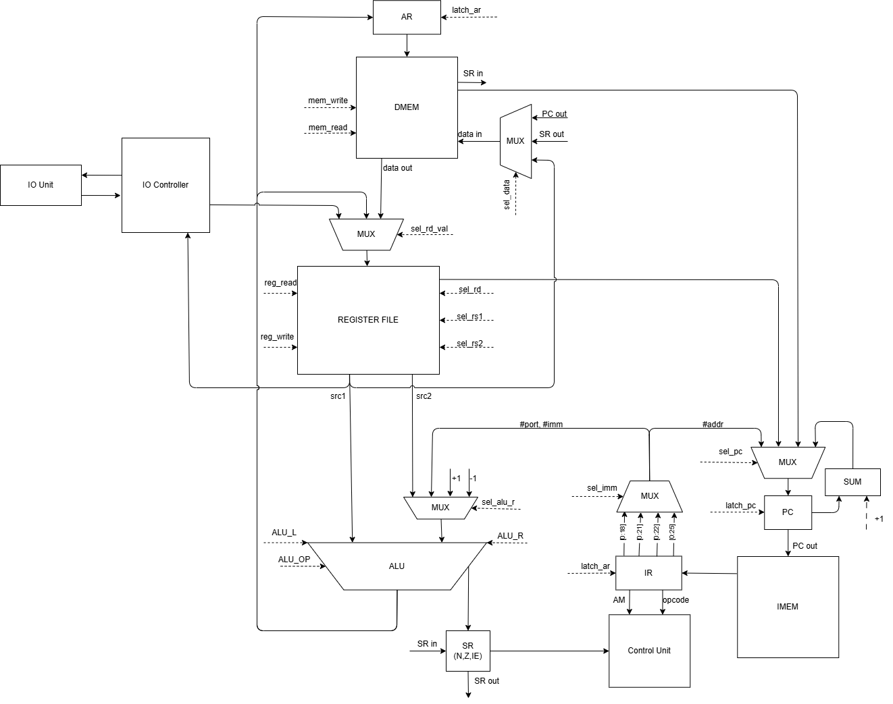
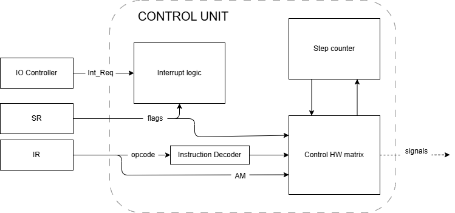

# Симулятор ЭВМ

## Автор
- ФИО: Панченко Антон Дмитриевич
- ИСУ: 467018
- Группа: P3215

## Вариант
```md
forth | risc | harv | hw | tick | binary | trap | port | pstr | prob2 | superscalar
```

| Опция | Реализация |
| --- | --- |
| `forth` | Минимальный Forth-подобный язык с обратной польской нотацией |
| `risk` | RISC-подобная ISA для стекового процессора |
| `harv` | Раздельные память команд и память данных; транслятор формирует отдельные бинарные образы |
| `hw` | Блок управления проектируется как hardwired |
| `tick` | Модель процессора должна исполняться с точностью до такта и вести тактовый журнал |
| `binary` | Машинный код и память данных сериализуются в настоящие бинарные файлы |
| `trap` | Ввод реализуется через trap-прерывания по расписанию входных токенов; обработчик пишется на Forth |
| `port` | реализация ввод-вывода при помощи port-mapped с адресацией портов  |
| `pstr` | Статические строки хранятся в памяти команд как Pascal-строки |
| `prob2` | Обязательная программа: Разность сумм квадратов и квадрата сумм  |
| `superscalar` | Усложнение не было реализовано |

## Язык программирования

Исходный язык проекта -- Forth-подобный язык с обратной польской нотацией. Программа представляет собой последовательность токенов, которые исполняются слева направо.

```ebnf
<label> ::= ([a-z] | [A-Z] | "-" | "_")+ ([a-z] | [A-Z] | [0-9] | "-" | "_")*
<number> ::= ("-")? [0-9]+

<program> ::= ( <definition> | <word> )*
<definition> ::= <procedure> | <init_variable>
<procedure> ::= ": " <label> ( <word> )* " ;"
<init_variable> ::= "VARIABLE " <label>

<conditional_operator> ::= "IF " ( <word> )* ( "ELSE " ( <word> )* )? "THEN"
<do_loop_operator> ::= "DO " ( <word> | "I" )* "LOOP"
<begin_while_operator> ::= "BEGIN " ( <word> )* "WHILE " ( <word> )* "REPEAT"

<word> ::= "MAIN" | <call> | <number> | <math_operand> | <stack_operand> | <mem_operand>
         | <io_operand> | <trap_operand> | <exec_operand> | <string_literal>
         | <conditional_operator> | <do_loop_operator> | <begin_while_operator>

<call> ::= <label>
<math_operand> ::= "+" | "-" | "*" | "/" | "MOD" | "=" | "<" | ">"
<stack_operand> ::= "DUP" | "DROP" | "SWAP" | "OVER" | "ROT" | "-ROT" | "TUCK"
<mem_operand> ::= "@" | "!"
<io_operand> ::= "IN" | "OUT" | "HALT"
<trap_operand> ::= "EI" | "DI" | "IRET" | "SET-ISR"
<exec_operand> ::= "' " <label> | "EXECUTE"
<string_literal> ::= "P\" " <any_text_until_quote> "\""

<comment> ::= "\ " <any_text_until_newline>
```

---

### семантика
Вычисления выполняются последовательно слева направо. Числовой литерал кладет значение на стек данных, строковый литерал кладет адрес статической Pascal-строки в памяти данных, а имя встроенного или пользовательского слова вызывает соответствующий код. Операции записываются в обратной польской нотации

Токены отделяются пробелами. Строковый литерал `P" ..."` считается единым токеном, включающим весь текст вплоть до закрывающей кавычки.

#### Область видимости:
- область видимости слов (процедур и переменных) глобальная;
- имена процедур и переменных доступны глобально по всему коду;
- статические строки не имеют имён и доступны исключительно по стартовому адресу, который строковый литерал кладёт на стек.

#### Переменные и память:
- определение `VARIABLE name` выделяет одно машинное слово в памяти данных;
- обращение к `name` кладет на стек данных адрес этой ячейки памяти;
- чтение и запись значений осуществляются явным разыменованием указателей с помощью слов `@` (чтение) и `!` (запись).

#### Execution token (Токен исполнения):
- значение, которое ссылается на исполняемое слово;
- токен получается словом `'` (`' MAIN`) и выполняется словом `EXECUTE`;
- апостроф используется только тогда, когда нужно получить ссылку на слово как на данные;
- без `'` имя слова означает немедленный вызов этого слова.

#### Процедуры и прерывания:
- процедура определяется через `: name ... ;`
- вызов процедуры сохраняет текущий адрес возврата на стек возвратов процессора;
- после сохранения адреса возврата управление передается телу процедуры;
- символ `;` компилируется как стандартный возврат из подпрограммы;
- аргументы и результаты процедуры передаются через стек данных;
- для обработки прерываний токен исполнения регистрируется словом `SET-ISR` для нужного вектора, а возврат из обработчика прерывания выполняется явным вызовом встроенного слова `IRET`.

#### Управление потоком:

- `IF ... ELSE ... THEN` снимает со стека предикат. Ноль означает ложь, любое ненулевое значение — истину. При истине выполняется блок после `IF`, при лжи — блок после `ELSE` (опционально).
- `BEGIN ... WHILE ... REPEAT` — цикл с предусловием. Код выполняется от `BEGIN` до WHILE, после чего со стека снимается предикат. Если он не равен нулю, выполняется блок до REPEAT и управление возвращается на `BEGIN`. Если предикат равен нулю, происходит выход из цикла за слово `REPEAT`.
- `DO ... LOOP` — счетный цикл. Перед `DO` на стеке должны лежать граница и начальное значение: `limit` `start`. Внутренний индекс цикла доступен через встроенное слово `I`. На каждой итерации индекс увеличивается на 1, и цикл продолжается, пока `I < limit`.


#### 1. Математические и логические операнды (`<math_operand>`)

- **`+`** `( a b -- a+b )` : Сложение двух верхних элементов стека.
- **`-`** `( a b -- a-b )` : Вычитание вершины стека из элемента под ней.
- **`*`** `( a b -- a*b )` : Умножение.
- **`/`** `( a b -- a/b )` : Целочисленное деление.
- **`MOD`** `( a b -- a%b )` : Остаток от целочисленного деления.
- **`=`** `( a b -- flag )` : Флаг равен `1` (True), если `a` равно `b`, иначе `0` (False).
- **`<`** `( a b -- flag )` : Флаг равен `1`, если `a < b`, иначе `0`.
- **`>`** `( a b -- flag )` : Флаг равен `1`, если `a > b`, иначе `0`.

#### 2. Операции со стеком (`<stack_operand>`)

- **`DUP`** `( a -- a a )` : Дублирует верхний элемент стека.
- **`DROP`** `( a -- )` : Удаляет верхний элемент стека.
- **`SWAP`** `( a b -- b a )` : Меняет местами два верхних элемента.
- **`OVER`** `( a b -- a b a )` : Копирует второй элемент стека на вершину.
- **`ROT`** `( a b c -- b c a )` : Сдвигает третий элемент стека на вершину (циклический сдвиг влево).
- **`-ROT`** `( a b c -- c a b )` : Сдвигает вершину стека на третье место (циклический сдвиг вправо).
- **`TUCK`** `( a b -- b a b )` : Копирует вершину стека под второй элемент.

#### 3. Работа с памятью (`<mem_operand>`)

- **`@`** `( addr -- value )` : Читает машинное слово из памяти данных по адресу `addr`.
- **`!`** `( value addr -- )` : Записывает значение `value` в память данных по адресу `addr`.

#### 4. Ввод-вывод (Port-mapped, `<io_operand>`)

- **`IN`** `( port_num -- value )` : Читает значение из порта с номером `port_num` и кладет на стек.
- **`OUT`** `( value port_num -- )` : Записывает значение `value` в порт с номером `port_num`.

#### 5. Система прерываний (`<trap_operand>`)

- **`EI`** `( -- )` : Enable Interrupts. Разрешает глобальную обработку прерываний процессором.
- **`DI`** `( -- )` : Disable Interrupts. Запрещает глобальную обработку прерываний.
- **`IRET`** `( -- )` : Interrupt Return. Возврат из обработчика прерывания (восстанавливает счетчик команд и статус).
- **`SET-ISR`** `( xt vector_num -- )` : Регистрирует токен исполнения `xt` как обработчик прерывания для вектора `vector_num`.

#### 6. Токены исполнения (`<exec_operand>`)

- **`'`** *(tick)* `( -- xt )` : Во время компиляции берет следующее за ним слово (например, `' MAIN`) и кладет его адрес (Execution Token) на стек.
- **`EXECUTE`** `( xt -- )` : Вызывает подпрограмму, адрес которой (xt) находится на вершине стека.

#### 7. Строки и литералы

- **`<number>`** `( -- n )` : Кладет число `n` на вершину стека.
- **`<string_literal>`** `( -- addr )` : Конструкция `P" Text"` компилирует строку в формате Pascal-string (длина + символы) в секцию статических данных и кладет ее стартовый адрес `addr` на стек. Один символ = одному машинному слову

#### 8. Управление потоком (Control Flow)

- **`IF ... ELSE ... THEN`** : Извлекает значение со стека. Если оно не равно нулю, выполняется блок после `IF`. Если равно нулю, выполняется блок после `ELSE` (если он есть). `THEN` отмечает конец ветвления.
- **`BEGIN ... WHILE ... REPEAT`** : Цикл с предусловием. Выполняет код до `WHILE`, извлекает значение. Если 1, выполняет код до `REPEAT` и прыгает на `BEGIN`. Если 0, прыгает за `REPEAT`.
- **`DO ... LOOP`** : Классический цикл со счетчиком. Берет со стека начальное и конечное значение `( limit start -- )`. Выполняется, пока внутренний счетчик не достигнет `limit`.


---

## Организация памяти

Архитектура процессора базируется на Гарвардской модели, что подразумевает полное физическое и логическое разделение памяти команд и памяти данных.

- **Размер машинного слова:** 32 бита. Память команд и память данных являются слово-адресуемыми
- **Размер регистров:** 32 бита.

На аппаратном уровне транслятор использует 8 регистров.
- R0 — Используется как системный ноль 
- R1-R3 - используются как временные буферы для вычислений
- R4-R5 (TOS, NOS) могут кэшировать верхушку стека для оптимизации
- R6 (SP) — Указывает на вершину стека данных в DMEM. 
- R7 (RP) — Указывает на вершину стека возвратов в DMEM.

#### Память данных (DMEM)

```text
ПАМЯТЬ ДАННЫХ 
┌───────────────────────────────┐ 0xffffffff
│                               │
│            DATA_STACK         │
│                               │ 
├───────────────────────────────┤ 
│                               │
│           RETURN_STACK        │
│                               │  
├───────────────────────────────┤ 
│                               │
│           STATIC_DATA         │
│                               │ 
└───────────────────────────────┘ 0x0
```

- **STATIC_DATA** Глобальные переменные и строковые литералы размещаются транслятором начиная с адреса 0x0
- **DATA_STACK** - Служит для передачи аргументов между функциями и хранения временных результатов вычислений
- **RETURN_STACK** - Используется для сохранения адресов возврата (PC + 1) при вызове процедур 


#### ПАМЯТЬ КОМАНД (IMEM)

```text
ПАМЯТЬ КОМАНД (IMEM)
┌───────────────────────────┐ 0xffffffff
│                           │
│             CODE          │
│                           │
├───────────────────────────┤ 
│                           │ 
│      INTERUPT_VECTOR      │
│                           │
├───────────────────────────┤ 0x1
│                           │
│       JMP_TO_CODE         │
│                           │
└───────────────────────────┘ 0x0
```

- **JMP_TO_CODE** - одиночная инструкция, которая является адресной командой JMP, которая переходит на начало секции `CODE`
- **INTERUPT_VECTOR** - таблица векторов прерываний
- **CODE** - код программы

---

## Система команд

### 1. Особенности процессора


**Архитектура:** RISC — все математические и логические операции с данными проходят reg-to-reg. Взаимодействие с памятью данных строго изолировано и осуществляется только через команды LD и ST.

**Типы данных и машинные слова:** 
  - Размер машинного слова — 32 бита
  - Базовый тип данных — 32-битное знаковое целое число. 
  - Строки представлены в формате Pascal-string (pstr), где длина строки и каждый ее символ занимают ровно по одному 32-битному машинному слову.

**Ввод-вывод:** 
  - port-mapped (port) — порты ввода/вывода изолированы от адресного пространства памяти, взаимодействие с ними осуществляется напрямую из регистров по номеру порта.
  - Ввод осуществляется токенами через систему прерываний: при старте модели задается расписание ([(1, 'h'), (10, 'e'), (20, 'l'), (25, 'l'), (100, 'o')] - где число указывает такт возникновения аппаратного прерывания, после которого символ можно прочитать из порта ввода).

**Поток управления и система прерываний:** 
 - инкремент PC после каждой инструкции; условные и безусловные переходы; вызов и возврат из процедур работают через аппаратный стек возвратов (RP).
 -  При срабатывании прерывания процессор аппаратно сохраняет текущий PC и регистр статуса (SR) на стек возвратов и переходит к обработчику; возврат из прерывания и восстановление контекста происходит по специальной инструкции IRET.

**Способы адресации:**
- **Непосредственная адресация** - 1 такт (AF). Операнд извлекается из самой команды и сразу подается на один из входов АЛУ
- **Регистровая адресация** - 1 такт (AF). Операнды физически находятся в регистрах общего назначения
- **Абсолютная адресация** - 1 такт (AF).
  - *В командах перехода* - При выполнении это значение напрямую заменяет текущий PC
  - *В командах LD/ST* - Позволяет напрямую читать или записывать статические переменные в области `STATIC_DATA`

### 2. Набор инструкций

| Команда | Опкод | Такты (EF) | Описание |
| --- | --- | --- | --- |
| LUI Rd, #imm | 0x00 | 1 | Rd <- imm << 10 |
| LD Rd, Rs | 0x01 | 2 | Rd <- mem[Rs] |
| ST Rd, Rs | 0x02 | 2 | mem[Rs] <- Rd |
| ADD Rd, Rs1, Rs2 | 0x11 | 1 | Rd <- Rs1 + Rs2 |
| SUB Rd, Rs1, Rs2 | 0x12 | 1 | Rd <- Rs1 - Rs2 |
| MUL Rd, Rs1, Rs2 | 0x13 | 1 | Rd <- Rs1 * Rs2 |
| DIV Rd, Rs1, Rs2 | 0x14 | 1 | Rd <- Rs1 / Rs2 |
| MOD Rd, Rs1, Rs2 | 0x15 | 1 | Rd <- Rs1 % Rs2 |
| CMP Rs1, Rs2 | 0x16 | 1 | SR.N, SR.Z <- Rs1 - Rs2 |
| JMP #addr | 0x20 | 1 | PC <- addr |
| BEQ #addr | 0x21 | 1 | PC <- addr if Z=1 |
| BNE #addr | 0x22 | 1 | PC <- addr if Z=0 |
| BGT #addr | 0x23 | 1 | PC <- addr if Z=0 and N=0 |
| BLT #addr | 0x24 | 1 | PC <- addr if N=1 |
| CALL #addr | 0x30 | 2 | RP <- RP - 1; mem[RP] <- PC + 1; PC <- addr |
| RET | 0x31 | 2 | RP <- RP + 1; PC <- mem[RP] |
| PUSH Rs | 0x32 | 2 |  SP <- SP - 1; mem[SP] <- Rs |
| POP Rd | 0x33 | 2 |  Rd <- mem[SP]; SP <- SP + 1 |
| IN Rd, #port | 0x40 | 1 | Rd <- IO[port] |
| OUT Rs, #port | 0x41 | 1 | IO[port] <- Rs |
| EI | 0x42 | 1 | SR.IE <- 1 |
| DI | 0x43 | 1 | SR.IE <- 0 |
| IRET | 0x44 | 4 |  SR <- mem[RP]; RP <- RP + 1; PC <- mem[RP]; RP <- RP + 1 |
| HLT | 0x45| 1 | stop |


---

### 3. Способ кодирования инструкций

Размер инструкции - 32 бита. 
Формат инструкции:

```text
LD, ST
┌───────────┬─────────┬─────────┬──────────────────────────────────────────┐
│     7     │    3    │    1    │                    21                    │
├───────────┼─────────┼─────────┼──────────────────────────────────────────┤
│  opcode   │   Rd    │   AM    │                  #addr                   │
│ 0x01-0x02 │         │         │             0x0: абсолютная              │
│           │         │         ├─────────┬────────────────────────────────┤
│           │         │         │    3    │               18               │
│           │         │         ├─────────┼────────────────────────────────┤
│           │         │         │   Rs    │             unused             │
│           │         │         │         │     0x1: регистровая           │
└───────────┴─────────┴─────────┴─────────┴────────────────────────────────┘

LUI
┌───────────┬─────────┬────────────────────────────────────────────────────┐
│     7     │    3    │                         22                         │
├───────────┼─────────┼────────────────────────────────────────────────────┤
│  opcode   │   Rd    │                       #imm22                       │
│   0x00    │         │             запись в старшие 22 бит                │
└───────────┴─────────┴────────────────────────────────────────────────────┘

ADD, SUB, MUL, DIV, MOD, CMP
┌───────────┬─────────┬─────────┬────┬─────────────────────────────────────┐
│     7     │    3    │    3    │ 1  │                 18                  │
├───────────┼─────────┼─────────┼────┼─────────────────────────────────────┤
│  opcode   │   Rd    │   Rs1   │ AM │                #imm                 │
│ 0x11-0x16 │         │         │    │         1: непосредственная         │
│           │         │         │    ├─────────┬───────────────────────────┤
│           │         │         │    │    3    │             15            │
│           │         │         │    ├─────────┼───────────────────────────┤
│           │         │         │    │   Rs2   │           unused          │
│           │         │         │    │         │         0: регистровая    │
└───────────┴─────────┴─────────┴────┴─────────┴───────────────────────────┘

JMP, BEQ, BNE, BGT, BLT, CALL
┌───────────┬──────────────────────────────────────────────────────────────┐
│     7     │                              25                              │
├───────────┼──────────────────────────────────────────────────────────────┤
│  opcode   │                            #addr                             │
│0x20-0x24, │                          абсолютная                          │
│   0x30    │                                                              │
└───────────┴──────────────────────────────────────────────────────────────┘

IN, OUT
┌───────────┬─────────┬────────────────────────────────────────────────────┐
│     7     │    3    │                         22                         │
├───────────┼─────────┼────────────────────────────────────────────────────┤
│  opcode   │  Rd/Rs  │                       #port                        │
│ 0x40-0x41 │         │                                                    │
└───────────┴─────────┴────────────────────────────────────────────────────┘

PUSH, POP
┌───────────┬─────────┬────────────────────────────────────────────────────┐
│     7     │    3    │                         22                         │
├───────────┼─────────┼────────────────────────────────────────────────────┤
│  opcode   │   Rd    │                       unused                       │
│ 0x32-0x33 │         │                                                    │
└───────────┴─────────┴────────────────────────────────────────────────────┘

RET, EI, DI, IRET, HLT
┌───────────┬──────────────────────────────────────────────────────────────┐
│     7     │                              25                              │
├───────────┼──────────────────────────────────────────────────────────────┤
│  opcode   │                            unused                            │
│ 0x31,     │                                                              │
│ 0x42-0x45 │                                                              │
└───────────┴──────────────────────────────────────────────────────────────┘

```       

## Транслятор

#### Интерфейс командной строки

```
uv run python main.py translate <source.s> <imem.bin> <dmem.bin>
uv run python main.py run <imem.bin> <dmem.bin> [-i <input.txt>] [-t <trace.log>]
```

Команда translate компилирует исходный Forth-код в два раздельных бинарных файла:
- source.s - исходный код программы написанной на forth 
- imem.bin - выходной бинарный файл памяти инструкций 
- dmem.bin - выходной бинарный файл памяти данных

Команда run запускает тактовую симуляцию процессора:
- input.txt - файл входных данных в виде расписания аппаратных прерываний в формате `tick value`.
- trace.log - сохраняет трассировку процессора для отладки.

#### Этапы

```
src -> tokenize -> translate (Pass 1) -> link (Pass 2) -> encode -> write_files
```

1. tokenize - лексический анализ на регулярных выражениях.
Токены: `WORD`, `NUMBER`, `STRING` . Комментарии и пробелы отбрасываются.
2. translate - синтаксический анализ и генерация промежуточного кода. Генерируются объекты Instruction и аллоцируется статическая память. Обрабатываются конструкции forth
3. link - разрешение символических ссылок. Заменяет метки на конкретные числовые адреса. Вычисляет старшие и младшие части 32-битных констант. Если в коде использовалось слово `EXECUTE`, автоматически генерируется таблица диспетчеризации в конце IMEM.
4. encode - бинарное кодирование. Упаковывает IR-инструкции в 32-битные строки согласно форматам ISA.
5. write_files - запись раздельных бинарных образов в `imem.bin` и `dmem.bin`.


## Модель процессора

### DataPath
Реализована Гарвардская архитектура с раздельными памятью команд (`IMEM`) и памятью данных (`DMEM`).



**Регистры общего назначения и указатели**: `R0`–`R7`. 
  - `R6` аппаратно выделен под указатель стека данных (`SP`).
  - `R7` аппаратно выделен под указатель стека возвратов (`RP`).
**Специальные регистры (защёлки)**: 
  - `PC` (Program Counter) — счётчик команд.
  - `IR` (Instruction Register) — регистр текущей инструкции.
  - `AR` (Address Register) — регистр адреса для работы с памятью данных.
  - `data_bus` — внутренняя защёлка шины данных для промежуточного хранения при чтении из памяти.
**Регистр статуса (SR)**: хранит аппаратные флаги `N` (Negative), `Z` (Zero) и `IE` (Interrupt Enable). Имеет аппаратную упаковку/распаковку в единое машинное слово для сохранения на стек при прерываниях (`get_sr` / `set_sr`).
**ALU**: реализует операции `ADD, SUB, MUL, DIV, MOD, CMP`. 
  - Выполняет аппаратное расширение знака (`sign_extend`) до 32 бит.
  - По результату операции автоматически обновляет флаги `Z` и `N`.
  - Инструкция `CMP` выполняет вычитание только для изменения флагов, не записывая результат в целевой регистр.
**Доступ к памяти**:
  - Чтение инструкций: `IR <- IMEM[PC]` (прямой доступ, только чтение).
  - Работа с `DMEM`: адресация всегда происходит через защёлку `AR`.
  - Чтение (`LD`, `POP`): `data_bus <- DMEM[AR]`, затем значение переносится в целевой регистр `Rd`.
  - Запись (`ST`, `PUSH`): `DMEM[AR] <- Rd` или сохранение системных регистров (`PC`, `SR`).
**Ввод-вывод (Port-mapped)**:
  - Выделенные инструкции `IN` и `OUT` используют номер порта из тела инструкции.
  - Порт `0` (`IN`): извлекает токен из входного буфера. Если буфер пуст, возвращает `0`.
  - Порт `1` (`OUT`): отправляет значение регистра в выходной буфер.

### Control Unit

Устройство управления построено на базе жёсткой логики (Hardwired Control Unit), смоделированной в виде конечного автомата (FSM). Каждый шаг соответствует одному такту генератора синхроимпульсов.



**Декодер**: комбинационная логика на фазе `AF` извлекает `opcode` (старшие 7 бит), номер целевого регистра `rd`, первого операнда `rs1`, флаг режима адресации `am` и константу/смещение.

**Обработка прерываний**:
  - На каждом такте контроллер ввода-вывода проверяет расписание (`check_interrupt_req`).
  - Перед началом цикла инструкции проверяется наличие запроса и флаг `IE == 1`. 
  - Если прерывание активно, запускается микропрограмма прерывания (3 такта: `INT1-INT3`), которая сохраняет `PC` и `SR` на стек возвратов (`R7`) и принудительно устанавливает `PC <- IMEM[1]`. Флаг `IE` сбрасывается.

**Цикл инструкции** динамический, занимает от 3 до 6 тактов:
  1. **IF (1 такт)**: Загрузка инструкции `IR <- IMEM[PC]` и `PC <- PC + 1`. Если `IR == 0`, процессор переходит в состояние `HALT`.
  2. **AF (1 такт)**: Декодирование опкода и операндов.
  3. **EX (1–4 такта)**: Фаза исполнения.
    - Арифметические операции (`ADD`, `MUL` и т.д.), ветвления и работа с портами ввода-вывода завершаются за 1 такт (`EX1`).
    - Операции с памятью данных (`LD`, `ST`, `PUSH`, `POP`, `CALL`) требуют 2 такта (`EX1` — установка `AR` и обращение к памяти, `EX2` — защёлкивание результата или изменение указателя стека).
    - Возврат из прерывания (`IRET`) является самой сложной инструкцией и занимает 4 такта (`EX1-EX4`), поочередно восстанавливая `SR` и `PC` со стека `R7`.

**Условные переходы (`BEQ, BNE, BGT, BLT`)**: 
  Реализованы комбинационной логикой на фазе `EX1`. Анализируются флаги `Z` и `N`. В случае истинности условия `PC` обновляется адресом из инструкции за 1 такт, иначе выполнение продолжается со следующей инструкции.

## Тестирование

### Подробный разбор одной из программ


